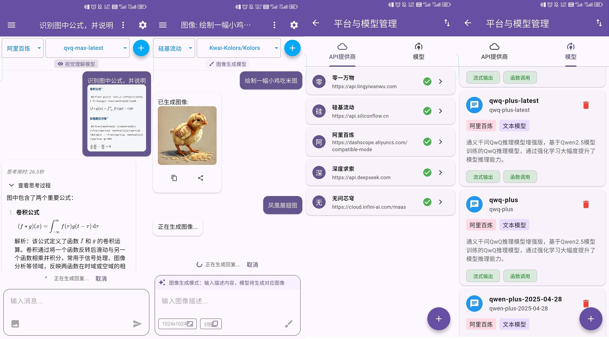

<p align="right">
  <a href="README-EN.md">English</a> |
  <a href="README.md">简体中文</a>
</p>

# SuChatTiny

SuChatTiny is a minimalist AI chat application developed with Flutter, powered by cloud-based large language model APIs.



## Overview

This application exclusively supports API platforms compatible with the OpenAI API structure. Compared to [SuChat-Lite](https://github.com/Sanotsu/SuChat-Lite), this version features:

- Completely redesigned architecture with a cleaner conversation interface
  - Supports image generation models (e.g., [SiliconFlow's](https://docs.siliconflow.cn/cn/api-reference/images/images-generations) `Kolors`, [Volcano Engine's](https://www.volcengine.com/docs/82379/1541523) `doubao-seedream-3.0-t2i`)
  - No branching conversations, no custom background/font settings, no speech-to-text input, no text size adjustment
  - No preset role-playing dialogues or related configurations, no advanced parameter settings
- Excludes other modules like image/video generation, speech synthesis, and speech recognition
- No built-in free API - users must provide their own API keys
- Tested only on Android 12 (Xiaomi 6); no cross-platform or desktop adaptation
- More focused functionality and smaller APK size

## Usage Instructions

1. On the home screen, click the settings button in the top-right corner
2. Enter your platform's URL and API key, then add the platform's models
3. Return to the conversation screen to select your platform and model for chatting
4. Switching platforms/models doesn't automatically create new conversations - use the "+" button in the top-right of the conversation list to start new dialogues
5. Note: This project doesn't include built-in free APIs

## Platform Model Management

In addition to manually adding OpenAI-compatible API providers and models, the app supports JSON file imports. The minimum required structure is:

```json
[
  {
    "platform": "<Platform Name>",
    "baseUrl": "<Base URL (exclude /v1/chat/completions)>",
    "apiKey": "<Platform API Key>",
    "models": [
      {
        "id": "<Model ID (used for request parameters)>",
        "type": "<Model type (supported: text, vision, image)>"
      }
    ]
  },
  {
    "platform": "SiliconFlow",
    "baseUrl": "https://api.siliconflow.cn",
    "apiKey": "sk-xxx",
    "models": [
      {
        "id": "Qwen/Qwen3-8B",
        "type": "text"
      },
      {
        "id": "Kwai-Kolors/Kolors",
        "type": "image"
      }
    ]
  }
]
```

## Development Environment

Developed on an Ubuntu 22.04 LTS virtual machine running on Windows 7 via VirtualBox 7.

```sh
# Development environment specifications:
$ lsb_release -c -a && uname -r -m
No LSB modules are available.
Distributor ID: Ubuntu
Description:    Ubuntu 22.04.3 LTS
Release:        22.04
Codename:       jammy
5.15.0-119-generic x86_64

# Flutter version as of 2025-05-23:
$ flutter --version
Flutter 3.29.2 • channel stable • https://github.com/flutter/flutter.git
Framework • revision c236373904 (2 months ago) • 2025-03-13 16:17:06 -0400
Engine • revision 18b71d647a
Tools • Dart 3.7.2 • DevTools 2.42.3
```

## Contribution

Issues and PRs are welcome for improvements.

---

—— Translated by DeepSeek
