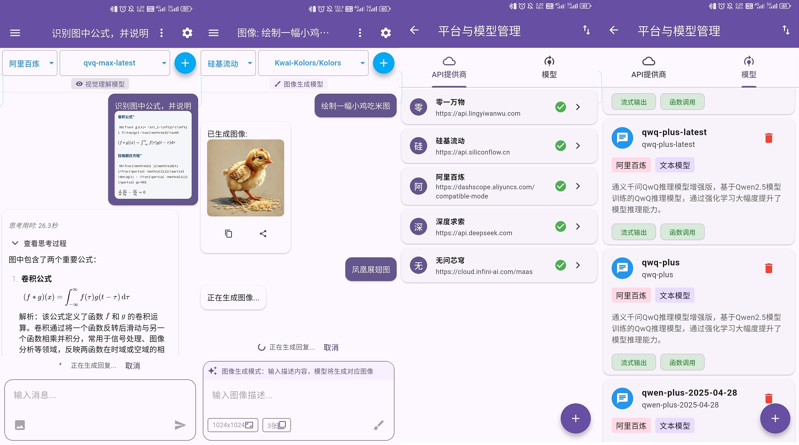

<p align="right">
  <a href="README-EN.md">English</a> |
  <a href="README.md">简体中文</a>
</p>

# suchat_tiny

SuChatTiny 是一个使用 Flutter 开发、以调用云平台在线大模型 API 驱动的、简洁版 AI 聊天应用。



仅支持兼容 Open AI 结构的 API 云平台 API。相较于[SuChat-Lite](https://github.com/Sanotsu/SuChat-Lite):

- 全新架构设计，全新简洁的对话页面
  - 对话支持图片生成模型(比如[硅基流动](https://docs.siliconflow.cn/cn/api-reference/images/images-generations)的`Kolors`、[火山引擎](https://www.volcengine.com/docs/82379/1541523)的`doubao-seedream-3.0-t2i`)
  - 没有分支对话、没有对话背景字体等自定义、没有语音输入转文、没有显示文本大小调节
  - 没有预设角色扮演对话和相关配置、没有高级参数配置
- 没有图片视频生成、语音合成、语音识别等其他模块内容
- 没有内置免费的 API，需要自行添加
- 只测试了 Android 12(小米 6)；没有适配其他平台，没有适配桌面端页面
- 功能更单纯、apk 体积更小

## 使用方法

- 进入首页后，点击右上角的设置按钮，填写好平台的 baseUrl 和 apiKey；然后添加好该平台的模型；回到对话首页，就可以选择平台和模型进行对话了。
- 切换平台和模型后不会自动创建新对话，点击对话列表右上角的"+"号图标创建新对话。
- 此项目没有内置免费的 API。

## 平台模型管理

除了可以手动添加兼容 Open AI 结构的 API 提供商和模型，也支持 json 文件导入，最小栏位结构如下:

```json
[
  {
    "platform": "<平台名称>",
    "baseUrl": "<基础地址，不必添加/v1/chat/completions>",
    "apiKey": "<平台密钥>",
    "models": [
      {
        "id": "<模型编号，用于构建请求参数的那个>",
        "type": "<模型分类，只支持:text、vision、image>"
      }
    ]
  },
  {
    "platform": "硅基流动",
    "baseUrl": "https://api.siliconflow.cn",
    "apiKey": "sk-xxx",
    "models": [
      {
        "id": "Qwen/Qwen3-8B",
        "type": "text"
      },
      {
        "id": "Kwai-Kolors/Kolors",
        "type": "image"
      }
    ]
  }
]
```

## 开发环境

在一个 Windows 7 中使用 Visual Box 7 安装的 Ubuntu22.04 LTS 虚拟机中进行开发。

```sh
# 开发机环境：
$ lsb_release -c -a && uname -r -m
No LSB modules are available.
Distributor ID: Ubuntu
Description:    Ubuntu 22.04.3 LTS
Release:        22.04
Codename:       jammy
5.15.0-119-generic x86_64

# 2025-05-23 使用的 flutter 版本：
$ flutter --version
Flutter 3.29.2 • channel stable • https://github.com/flutter/flutter.git
Framework • revision c236373904 (2 个月前) • 2025-03-13 16:17:06 -0400
Engine • revision 18b71d647a
Tools • Dart 3.7.2 • DevTools 2.42.3
```
